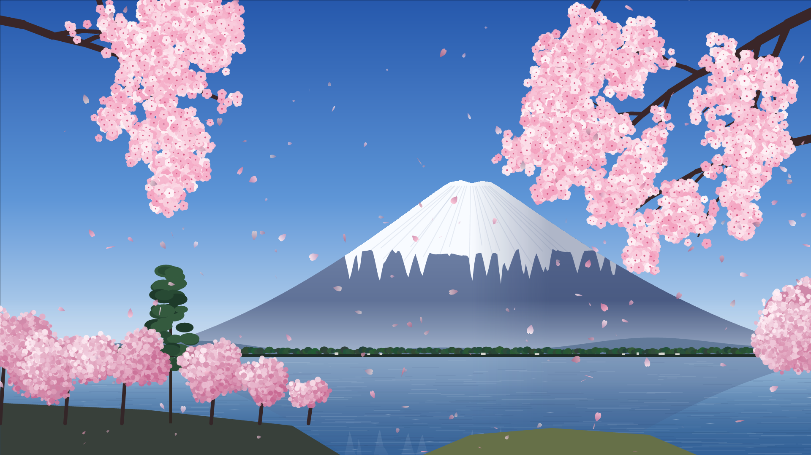
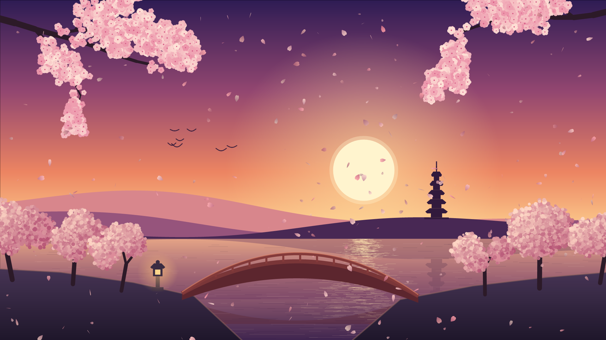
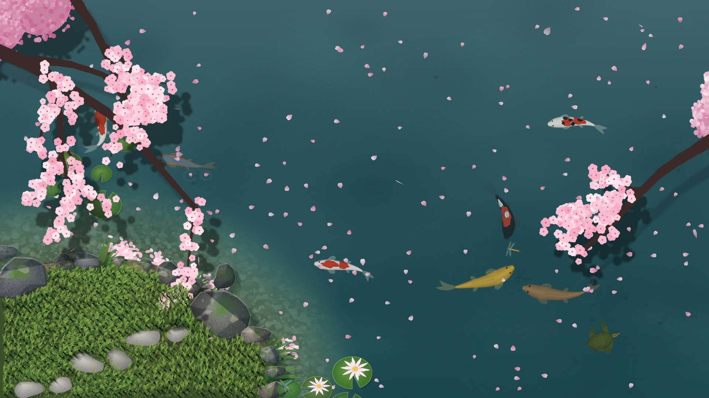
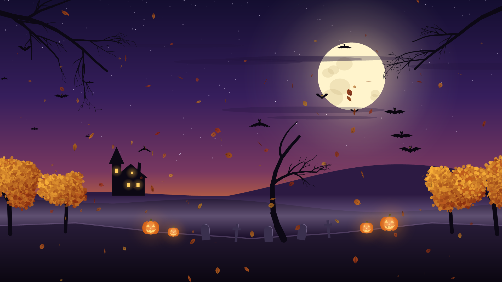
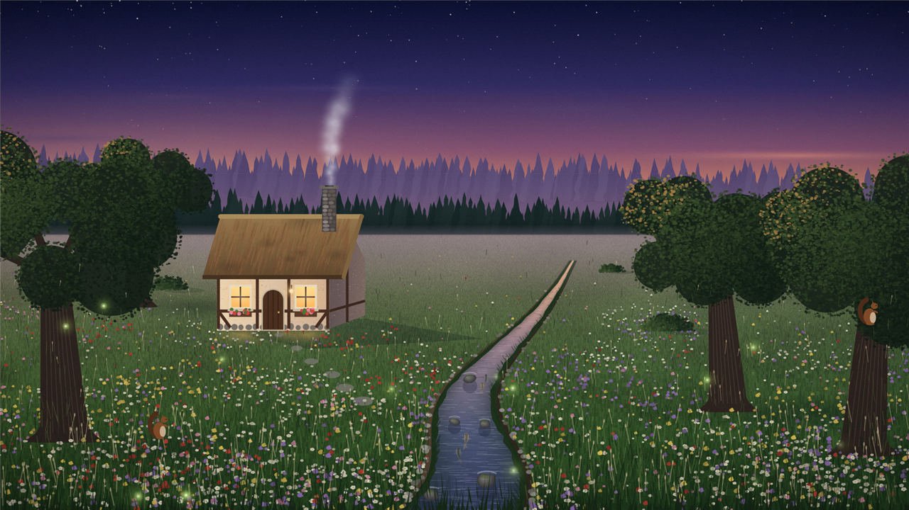

# Peckworks Screensavers

Native Windows screensavers written in C# (.NET 10, Windows Forms), plus a small reusable engine
for making more of them. So far: **Matrix Rain**, **Sakura**, **Sakura Dusk**, **Sakura Pond**,
**Halloween**, **Christmas** and **Cabin by Stream**.

## Matrix Rain

A close replica of the "digital rain" from *The Matrix* (1999): mirrored half-width katakana,
near-white flickering leading characters, fading green tails, characters that mutate in place,
drops at varied speeds and brightness, and a soft phosphor glow.


Settings: speed, density, character size, glow.

## Sakura

White and pink cherry blossom petals drifting down like snow over a painted scene of Mount Fuji
across a lake, framed by branches in full bloom. Stylized rather than photorealistic.



- Petals tumble, spin, sway, and ride a breeze that rises and settles.
- Depth: near petals are bigger, faster, and more opaque than far ones.
- Some petals let go of the blossoms on the branches; light glints on the lake.
- Trees stand on two banks of land in front of the lake, with a pine behind the grove.
- A small wooden boat with a roofed cabin, a boatman in a straw hat and a red lantern drifts
  slowly across the lake, passing behind the banks and trees.
- Branches and trees are grown randomly, so each run looks a little different.
- Twenty small **happenings** come and go at random, one every 5 to 12 seconds:

  | Where | What happens |
  |-------|--------------|
  | Fuji and the sky | A lens-shaped cap cloud (kasa-gumo) forms on the summit. The mountain blushes red, like Hokusai's Red Fuji. The sun crests the summit and blazes into a "Diamond Fuji". Origami paper cranes glide past. A painted kite dances on its string. A rainbow arcs over the lake. Cloud shadows drift across the mountain and the water. |
  | The far shore and the lake | A shinkansen races along the far shore. A sun shower glitters down and dimples the lake. A raft of fallen petals (hanaikada) drifts by. A mother duck leads her ducklings across. A kingfisher dives for a fish. Swallows skim the water. |
  | The banks | A heron stands in the shallows and strikes. A Shiba Inu trots along the hill, sits and smiles. Butterflies dance around the blossom trees. |
  | The branches | A pair of white-eyes (mejiro) visits the blossoms. A squirrel scampers along a branch. A glass wind chime (furin) swings and rings. |
  | Everywhere | A gust tears a blizzard of petals (hanafubuki) off the branches and sweeps it past you. |

Settings: number of petals, fall speed, breeze, petal size, and how often a surprise happens
(0 turns them off).

## Sakura Dusk

The same slowly falling petals over a different painting: a pond at sunset, with a low sun
setting behind hazy hills, a pagoda on the far shore, an arched wooden footbridge, a stone
lantern with a glowing window, and cherry trees on both banks. A small flock of birds flaps
slowly across the sky, each bird on its own rhythm, gliding now and then.



- Petals are tinted by the evening light, and golden glints twinkle in the sun's reflection.
- The nearest hills, the pagoda, and the bridge are mirrored faintly in the still water.
- The same boat as Sakura's, here a small silhouette far out near the opposite shore.
- Twenty happenings of its own, none shared with Sakura:

  | Where | What happens |
  |-------|--------------|
  | The sky and the sun | The sun's top edge flashes green. Rays of light fan up from the sun. The first star of evening appears and twinkles, then others. A crescent moon sinks behind the hills. Golden clouds drift by. The light deepens into a richer "magic hour". A crane flies across the face of the sun. |
  | The hills | A procession of fox lights (kitsune-bi) winds along the hills. |
  | The pond | Paper lanterns float across the water (toro nagashi). Koi glide under the surface. A lotus opens. Mist gathers over the water. A breeze ripples across the pond. A frog leaps in, as in Basho's haiku. |
  | The bridge and the banks | A cat crosses the bridge and sits to watch the sunset. Red paper lanterns light up along the rail. A tanuki waddles along the bank and tries to catch a petal. The cherry trees light up from below (yozakura). |
  | The air | Fireflies rise from the banks. Red dragonflies dart over the pond. |
- The same settings as Sakura (petals, fall speed, breeze, petal size, surprises), saved separately.

Sakura and Sakura Dusk share one petal engine and one set of painting brushes (banks, trunks,
blossoms, branches) in the Core project, so they have the same illustrative hand.

## Sakura Pond

A koi pond seen from above, the way you see one leaning on the rail of a bridge. The pond is
bigger than the view: still water fills the screen under cherry branches in full bloom, and the
only shore in sight is a corner of lawn at the bottom (left or right, the seed decides). Rocks
of every size sit along the water's edge, half in the water, each with a sunny face, a shaded
face, moss and lichen; a strip of damp sand and pebbles runs between them and the grass; iris
clumps stand among the stones; a path of stepping stones leads down to the water; lily pads and
water lilies float in the calm water nearby; and the branches throw dappled shadows on the water.
The lawn is grass in a breeze: a band of bent, lightened blades rolls across it as each gust
passes, and tufts of taller grass lean over and spring back as the wave reaches them.



- **Koi** of eight real varieties (kohaku, sanke, showa, yamabuki ogon, chagoi, asagi, tancho,
  plain red-orange) cruise the whole pond: a few tail beats, then a long glide. Each body bends
  through its turns along the path its head swam, never flipped or slid. They drift up and down
  in the water, hazier when deep, slip under the lily pads, and now and then come up to gulp at
  the surface, leaving a ring.
- A **turtle** (a red-eared slider, the turtle of nearly every park pond in Japan) paddles just
  under the surface, front left leg with back right and then the other pair, with a small surge
  on each stroke, turning as one rigid piece in wide slow arcs. Now and then it stops, spreads
  its legs and floats, pokes its nose up for a breath (one small ring), then paddles off.
- **Petals** let go of the blossom, sway and tumble down, their shadows sliding in to meet them,
  touch the water with a tiny ring, then float, drifting slowly and gathering against the banks.
- **Dragonflies** (shiokara tombo, the pale blue dragonfly of Japanese ponds) hover, dart and stop
  dead, perch on lily pads, and the golden female dips to touch her tail to the water.
- **Swallows** visit to drink: low, fast, sweeping curves with bursts of wingbeats and swept-back
  glides, skimming the surface with a line of rings, their shadows racing below them.
- Now and then a **snake** (a shimahebi, the four-lined rat snake) comes out of the grass, swims
  across the pond with its body weaving behind its head and a small wake, and slips away.

Settings: petals, number of koi, number of turtles, number of dragonflies, how often the
swallows visit, and how often the snake crosses.

On a 4K screen it draws at 2560 wide and Windows enlarges the picture: the scene is soft and
painterly, so the enlarging loses almost nothing, and it keeps the frame rate.

## Halloween

Autumn leaves in gold and red drifting down over a moonlit graveyard hill: a big full moon, a
haunted house with lit windows on the far hill, a dead tree, tombstones, a waving skeleton, autumn
trees, and bare branches clawing in from the top corners.



- Bats flap across the sky in three sizes, swooping as they go.
- The jack-o'-lanterns flicker like candles, and the skeleton waves.
- The leaves are the Sakura petal engine with a leaf outline, and they let go of the autumn trees.
- Nineteen small **happenings** come and go at random, one every 5 to 12 seconds, shuffled like a
  deck of cards so you see them all before any repeats:

  | Where | What happens |
  |-------|--------------|
  | The sky | Halloween fireworks (purple and orange, or green) burst and sparkle. A shooting star. A bolt of lightning. Stars join up into a constellation (a bat, a pumpkin, a ghost...). Three little ghosts float past in single file. |
  | The moon | The moon turns blood red. A witch on a broomstick flies across it. |
  | The far hill | The haunted house's windows flicker out and come back green. A cloud of bats pours out of its tower. Something huge with glowing eyes peeks over the hill. |
  | The graveyard | A ghost rises from a grave and says boo. A zombie hand claws up out of the ground. Will-o'-the-wisps drift among the stones. The skeleton's eyes glow red. A jack-o'-lantern changes its expression. A black cat trots through. |
  | The trees | A spider spins a web in the dead tree, strand by strand. Another lowers itself from a branch on a thread. Pairs of eyes open in the dark. |

Settings: number of leaves, fall speed, breeze, leaf size, number of bats, and how often a
surprise happens (0 turns them off).

Adding more happenings, here or to another screensaver, is a recipe:
[docs/ADDING_HAPPENINGS.md](docs/ADDING_HAPPENINGS.md).

## Christmas

Snow falling on a snowy night: pines strung with pastel lights that twinkle, a log cabin with
warm windows and a smoking chimney, snowy mountains, and a moon.


- Santa's sleigh crosses the sky, passing behind the overhanging branches, pulled by four
  galloping reindeer. Rudolph leads, and his red nose glows and sparkles.
- Every bulb (pink, mint, baby blue, lavender, butter, peach) brightens and dims on its own rhythm.
- The snow is the Sakura petal engine drawing soft white dots.
- Twenty small **happenings** come and go at random, as in Halloween:

  | Where | What happens |
  |-------|--------------|
  | The sky | A shooting star to wish on. The northern lights ripple. Stars join up into a snowflake, a star, a tree, a candy cane or a bell. Festive fireworks (gold and silver, red and green, or icy blue). A gust of wind whirls snow across. A drift of golden fairy dust swoops through. |
  | The moon | An ice halo with a faint rainbow forms around it. |
  | Santa | A present tumbles off the sleigh and lands in the snow. |
  | Far off | A toy train with lit windows crosses the valley. A reindeer stands on the mountain ridge. |
  | The snow | A fox trots through and stops to sniff. A rabbit hops by. A snowman builds itself and waves. A snowball rolls across, growing. A clump of snow slides off a pine. |
  | The cabin and the lights | Smoke rings (and a heart) from the chimney. A wave of brightness runs through every light. The star on the tree flares and showers sparkles. |
  | The corners | Frost crystals grow across a corner of the glass. A snowy owl perches on a branch and blinks. |

Settings: amount of snow, fall speed, breeze, flake size, and how often a surprise happens
(0 turns them off).

Halloween and Christmas are built from the same shared pieces as the Sakura pair (the falling
engine, the ground, trees, hills and branches), plus one new one: sprites, small pictures painted
once and stamped each frame, which is how the bats, the sleigh and every moving light (candles,
bulbs, Rudolph's nose) are drawn.

## Cabin by Stream

A flowery meadow at dusk, painted to look as much like a photograph as a painted scene can: a
small thatched cottage with lit windows and white smoke rising from its chimney, a stream winding
toward you with trout holding in the current, squirrels running between the trees and up them,
and fireflies blinking over the grass. The last of the sunset glows low on the left; the first
stars are out overhead; mist lies at the feet of the far forest.



- The grass is textured pixel by pixel (coarser near you, hazier far away), with thousands of
  small wildflowers in drifts, blades and seed heads in the near meadow, long soft shadows that all
  fall away from the glow, and a camera's vignette and grain over the whole picture.
- The smoke is a crowd of puffs that rise fast while hot, slow as they cool, spread, lean with the
  breeze and thin away.
- The trout face upstream, drift slowly back and dart forward to hold their place, seen through
  the water. Light slides down the stream's surface.
- Each squirrel follows a plan: sit, run to the next tree (sometimes stopping to sit up and look
  about), climb, sit on the trunk, come down head first, run back.
- Fireflies blink on their own slow cycles and are mirrored in the stream when they cross it. The
  windows and the door lamp flicker like firelight; the brighter stars twinkle.
- No happenings yet.

Settings: fireflies, number of fish, number of squirrels, chimney smoke, breeze.

## Retired: Cotswold Brook

A real photograph of Cotswold cottages by a brook, with ripples, trout, smoke, a falling dusk,
fireflies and mist animated over it. Retired: its fish were flat stickers that only faced left
or right, flipped to turn and slid about, swimming under a mirror-bright pond where no fish
could be seen. The code stays in `src/CotswoldBrook/` as a reference for what not to do; it is
no longer built. Its `RETIRED.md` says what went wrong and the rules that came out of it. The
engine pieces it pioneered (fitting a photo, day for night, fireflies, mist, and the depth map
that lets a moving thing pass behind nearer scenery) stay in `Core/Photo/` for photo savers to
come. `scripts\depthmap.py` makes a depth map with
[Depth Anything V2](https://github.com/DepthAnything/Depth-Anything-V2) (Small model, Apache 2.0).

## All screensavers

- Run on every monitor, at native resolution (4K included).
- Live preview in Windows' Screen Saver Settings.
- A settings dialog with its own live preview.
- Each is one self-contained `.scr` file. The PC does not need .NET installed.

## Install

```powershell
.\scripts\install.ps1                          # build all, copy to System32 (one admin prompt), open Screen Saver Settings
.\scripts\install.ps1 -Saver Sakura -Activate  # build and install one, and select it with a 5-minute wait
```

Then pick one in the Screen Saver Settings list. The install script closes any Screen Saver
Settings window that was already open (an open one keeps showing its old list), opens a fresh one,
and confirms the new screensaver actually appears in its list.

No-admin alternative: run `.\scripts\publish.ps1`, then right-click a `.scr` in `dist\` in File
Explorer and choose **Install**. (Windows then uses the file where it sits, so leave it there.)

Remove with `.\scripts\uninstall.ps1` (all) or `.\scripts\uninstall.ps1 -Saver Sakura` (one).

## Try one without installing

```powershell
.\scripts\publish.ps1                                  # builds one dist\<Name>.scr per screensaver
.\dist\Sakura.scr /s                                   # full screen; move the mouse to exit
```

For development, run the plain build output (not the `.scr`; see the gotcha in the docs):

```powershell
dotnet build -c Release
$exe = ".\src\Sakura\bin\Release\net10.0-windows\Sakura.exe"
& $exe /window                                         # resizable window, Esc to close
& $exe /c                                              # settings dialog
& $exe /snapshot out.png 1920 1080 8                   # render 8 s off-screen, save a PNG + timing
```

## Verify

```powershell
.\scripts\verify.ps1                     # every .scr in dist\: snapshot speed, preview box, settings dialog
.\scripts\verify.ps1 -WindowsLaunch      # also let Windows start each one for real (your setting is restored)
```

Prints PASS / FAIL per check and saves pictures to `snapshots\verify\`. Look at the pictures too:
a check can pass while the picture is wrong.

## How it works

Start with **[docs/HOW_SCREENSAVERS_WORK.md](docs/HOW_SCREENSAVERS_WORK.md)**: a plain-language
guide to what a screensaver is, how Windows talks to it, and how both effects are built. Then read
`src/MatrixRain/MatrixRainScene.cs` or `src/Sakura/SakuraScene.cs`, both commented for a
first-time reader.

## Layout

```
src/Peckworks.Screensavers.Core/   the engine (command line, windows, drawing, glow, settings)
src/MatrixRain/                    the Matrix Rain screensaver
src/Sakura/                        the Sakura screensaver
src/SakuraDusk/                    the Sakura Dusk screensaver
src/SakuraPond/                    the Sakura Pond screensaver
src/Halloween/                     the Halloween screensaver
src/Christmas/                     the Christmas screensaver
src/CabinByStream/                 the Cabin by Stream screensaver
src/CotswoldBrook/                 retired: kept as a reference, not built (its RETIRED.md says why)
scripts/                           publish / install / uninstall / verify / happening (render one happening)
                                   / depthmap.py (a photo's depth map, made once)
docs/                              the how-it-works guide
```

## Performance (measured, i7-8850H laptop)

Time per frame (update + render):

| Resolution | Matrix Rain | Sakura      | Sakura Dusk | Halloween   | Christmas   | Cabin by Stream |
|------------|-------------|-------------|-------------|-------------|-------------|-----------------|
| 1920x1080  | about 10 ms | about 4 ms  | about 4 ms  | about 4 ms  | about 4 ms  | about 2 ms      |
| 3840x2160  | about 29 ms | about 11 ms | about 12 ms | about 15 ms | about 15 ms | about 9 ms      |

Under about 16 ms means the full 60 frames per second. Each frame waits for the screen's next
refresh before the next one is drawn, so frames reach the screen evenly, one per refresh (an
earlier timer ran slightly faster than the screen and showed a frame twice now and then: a
small judder you could see in anything moving steadily). Matrix Rain at 4K runs at about 34, above
the film's own 24.

Sakura Pond: about 11 ms at 1920x1080 and about 15 ms at 4K, where it draws at 2560x1440 and
Windows enlarges the picture (measured on a quiet machine, worst second 15 ms). The lawn in the
wind is about half of that: the carpet of blades slid and lit by the wind each frame costs about
3 ms at 1440p and the swaying tufts about 2 ms, drawn in parallel bands.

Halloween's happenings cost almost nothing on average: four minutes of ordinary play at 4K
averaged 12.5 ms, against 13.0 to 13.2 ms for the same scene with nothing on, measured in the same
minutes. Three are dearer while they last. At 4K each adds about 5 to 6 ms per frame in its worst
second, which is about 50 frames per second for that moment: the blood moon for its 12 seconds, a
firework for the half second of each burst, and a lightning flash for under half a second. The
hill monster adds about 2 ms. At 1920x1080 none of them drops a frame (the worst second of ten
minutes of play was 5.7 ms). `scripts\happening.ps1 -Sweep` prints the average, the worst second
and the slowest single frame for each one.

The sakura pair's happenings, measured the same way at 4K (each alone, next to a quiet baseline
in the same minutes; the quiet scene's worst second was about 14 to 15 ms): most add 1 to 3 ms in
their worst second. Six are dearer while they last: Red Fuji (about 7.5 ms more), cloud shadows
(about 4.5) and the petal blizzard (about 3.5) in Sakura; magic hour (about 8.5), the god rays
(about 7) and the lit trees (about 4) in Sakura Dusk. All six share one claim ("costly"), so the
director never lets two of them run at once and their costs never add up. At 1920x1080 none of
them drops a frame.

Christmas's happenings measure the same way: four minutes of ordinary play at 4K averaged 16.9 ms
against 15.7 to 21.3 ms quiet in the same minutes. The two dearer ones are the northern lights
(about 6 ms per frame more in their worst second at 4K, for 22 seconds) and the wave through the
lights (about 5 ms more, for 8 seconds). Painting all twenty sets of sprites takes about two thirds
of a second on a 4K screen (the fox alone about a fifth), which is why they are painted on a
helper thread while the scene plays, and a happening is not dealt until it has been painted.

Measure your own with `/snapshot`; the timing lands in `out.png.txt`.
